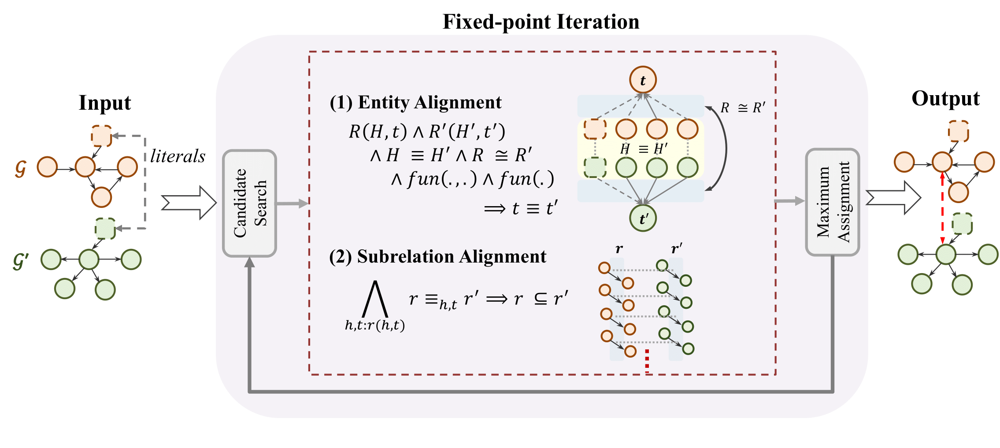

# FLORA

_This is a Python implementation of the paper [FLORA: Unsupervised Knowledge Graph Alignment by Fuzzy Logic]()._


FLORA is an unsupervised system for automatic knowledge graph (KG) alignment, jointly matching entities and relations in one KG to their equivalents in another.

FLORA is a simple yet effective method that (1) is unsupervised, i.e., does not require training data, (2) provides a holistic
alignment for entities and relations iteratively, (3) is based on fuzzy logic and thus delivers interpretable results, (4) provably converges, (5) allows dangling entities, i.e., entities without a counterpart in the other KG, and (6) achieves state-of-the-art results on major benchmarks.

FLORA extends the advanced system [PARIS](https://github.com/dig-team/PARIS), which has three key limitations: (1) no convergence guarantees, (2) poor performance when functional relations are absent, and (3) inability to see literal similarities beyond a strict identity.

## Environment setup

Clone the repository and set up the environment via "requirements.txt".
```
pip install -r requirements.txt
```

## Input

**Precondition.** 
Similar to PARIS, FLORA needs two knowledge graphs, which each contain: (1) a large number of instances. (2) a limited number of relations, (3) a large number of facts between instances, (4) a large number of facts between an instance and a literal. 

**Dataset.**
FLORA uses multiple datasets from different sources:

- [OpenEA](https://github.com/nju-websoft/OpenEA): D_W_15K_V1 and D_W_15K_V2
- [DBP15K](https://github.com/nju-websoft/JAPE): fr_en, ja_en, zh_en
- [OAEI KG Track](https://oaei.ontologymatching.org/2024/knowledgegraph/index.html): memoryalpha-stexpanded, starwars-swtor

We also provide two mini-test datasets: [Person, Restaurant](https://oaei.ontologymatching.org/2010/im/index.html) from OAEI 2010 for quick test. 
For detailed statistics on each dataset, please refer to `statistics.pdf`.

**String embedding.** 
To initialize literal similarities, the system computes embeddings for all strings (excluding dates). These embeddings are provided as xxx.pkl files in the `data/emb/` folder of each dataset. To reproduce these embeddings, run:
```
python literals.py <dataset_path> <emb_path>
```

Due to memory limitations, all datasets and pretrained embeddings used in the paper are on [google drive](https://drive.google.com/file/d/1KGsSvb-RX1wpBzkUlY7DBQkn4-pEY8E_/view?usp=sharing). Download and unzip all files in the `data` folder.


## Running the Code

To produce the alignment results, your could use the following command:

```bash
python main.py --dataset OpenEA/D_W_15K_V2/ --alpha 3.0 --init 0.7 --save_file dw-v2.ttl
```

If training data is available, run:
```bash
python main.py --dataset OpenEA/D_W_15K_V2/ --trainingdata OpenEA/D_W_15K_V2/721_5fold/1/train_links --alpha 3.0 --init 0.7 --save_file dw-v2-sup.ttl
```

Or you could directly run `bash run.sh` to reproduce the results.

### Evaluation and Analysis

The original alignment results (generated by running `main.py`) are stored in the `save` folder by default. To obtain clean results or to evaluate and analyze them, run `analysis.ipynb` block by block, adjusting gold standard path `REF_PATH` and results path `RES_PATH` as necessary.

## Citation

<!-- ```
@inproceedings{FLORA,
    title = ,
    author = ,
    booktitle = ,
    url = ,
}
``` -->