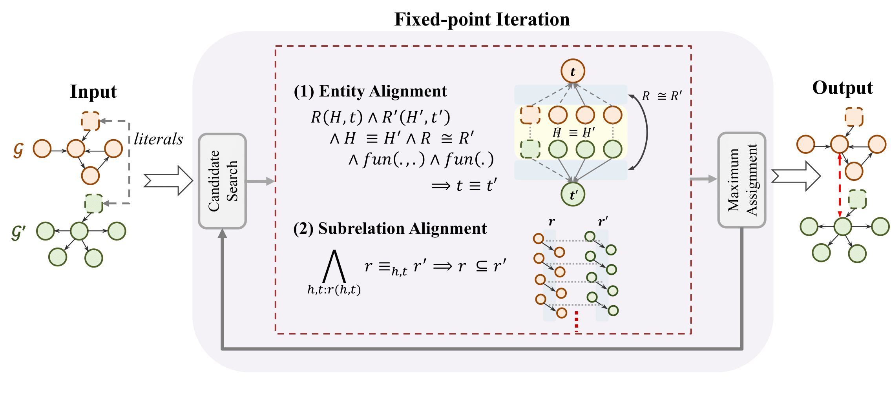

# FLORA

_This is a Python implementation of the paper [FLORA: Unsupervised Knowledge Graph Alignment by Fuzzy Logic](https://suchanek.name/work/publications/iswc-2025.pdf) (best paper award at ISWC 2025)._


FLORA is an unsupervised system for automatic knowledge graph (KG) alignment, jointly matching entities and relations in one KG to their equivalents in another.

FLORA is a simple yet effective method that (1) is unsupervised, i.e., does not require training data, (2) provides a holistic
alignment for entities and relations iteratively, (3) is based on fuzzy logic and thus delivers interpretable results, (4) provably converges, (5) allows dangling entities, i.e., entities without a counterpart in the other KG, and (6) achieves state-of-the-art results on major benchmarks.

FLORA extends [PARIS](https://github.com/dig-team/PARIS) system, which had three key limitations: (1) no convergence guarantees, (2) poor performance when functional relations are absent, and (3) the inability to see literal similarities beyond a strict identity.

## Running FLORA

**Check the preconditions.** 
Similar to PARIS, FLORA needs two knowledge graphs, which each contain: (1) a large number of instances. (2) a limited number of relations, (3) a large number of facts between instances, (4) a large number of facts between an instance and a literal. The input KGs have to be in [Turtle format](https://en.wikipedia.org/wiki/Turtle_(syntax)).

**Set up the environment.**
Clone this repository and set up the environment via "requirements.txt". Supports Python >=3.9, <3.12.
```
pip install -r requirements.txt
```

**Pre-compute the string embeddings.** 
To initialize literal similarities, FLORA needs embeddings for all strings (excluding dates and numbers). To produce these embeddings separately, run:
```
python literals.py <kg1> <kg2> <embedding_path>
```
For example:
```bash
python literals.py ../data/kg1.ttl ../data/kg2.ttl ../data/emb/
```
Here, kg1 and kg2 are paths to the knowledge graphs in Turtle format, and embedding_path is a path to a folder where the embeddings can be stored.

**Run the Code.**

To align two KGs, adapt the following command to your case:
```bash
python main.py --kg1 ../data/kg1.ttl --kg2 ../data/kg2.ttl --embedding ../data/emb/ --output results.ttl
``` 
If the embdding path is not provided or does not exist, embeddings will be automatically computed before performing the alignment. Optional parameters can be set with --alpha, --init, and --epsilon, see  [our paper](https://suchanek.name/work/publications/iswc-2025.pdf) or run `python main.py --help` for a description. 
If training data is available, specify its file path with --trainingdata parameter. The training file can be in any format (e.g., .txt, .ttl, .csv) but contain aligned entities between two KGs.

## Reproducing the experiments

**Dataset.**
FLORA uses multiple datasets from different sources:

- [OpenEA](https://github.com/nju-websoft/OpenEA): D_W_15K_V1 and D_W_15K_V2
- [DBP15K](https://github.com/nju-websoft/JAPE): fr_en, ja_en, zh_en
- [OAEI KG Track](https://oaei.ontologymatching.org/2024/knowledgegraph/index.html): memoryalpha-stexpanded, starwars-swtor

We also provide two mini-test datasets: [Person, Restaurant](https://oaei.ontologymatching.org/2010/im/index.html) from OAEI 2010 for quick test. 
For detailed statistics on each dataset, please refer to `statistics.pdf`.

Due to memory limitations, all datasets and pretrained embeddings used in the paper are on the [drive](https://nextcloud.r2.enst.fr/nextcloud/index.php/s/xj3oStmzLcknicr). Download and unzip all files in the `data` folder.

To produce the alignment results, use the following command for existing datasets:

```bash
python main.py --dataset OpenEA/D_W_15K_V2/ --embedding emb/D_W_15K_V2/ --alpha 3.0 --init 0.7 --output dw-v2.ttl
```

If training data is available, run:
```bash
python main.py --dataset OpenEA/D_W_15K_V2/ --embedding emb/D_W_15K_V2/ --trainingdata OpenEA/D_W_15K_V2/721_5fold/1/train_links --alpha 3.0 --init 0.7 --output dw-v2-sup.ttl
```

You can also run `bash run.sh` to reproduce the results.

**Evaluation and Analysis.**

The original alignment results (generated by running `main.py`) are stored in the `save` folder by default. To obtain clean results or to evaluate and analyze them, run `analysis.ipynb` block by block, adjusting gold standard path `REF_PATH` and results path `RES_PATH` as necessary.

## Citation

If you use this project for academic purposes, please cite  [our paper](https://suchanek.name/work/publications/iswc-2025.pdf):
```
@inproceedings{FLORA,
    title = "FLORA: Unsupervised Knowledge Graph Alignment by Fuzzy Logic",
    author = "Peng, Yiwen and Bonald, Thomas and Suchanek, Fabian",
    booktitle = "International Semantic Web Conference (ISWC)",
    year = 2025
}
```
